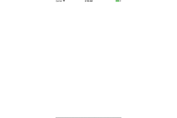
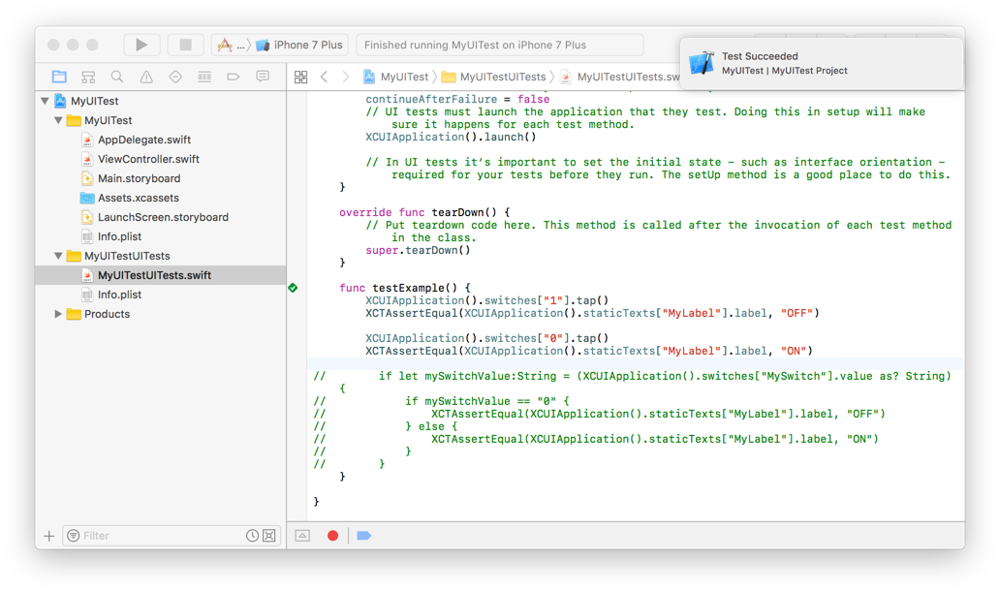

# MyUITest

MyUITest is a sample code of UI test using Swift.

## Description
- MyUITest is a sample code of UI test using Swift.
  - Function:Switching ON / OFF of UISwitch displays "ON · OFF" in UILabel
  - Test:UILabel display content is correct when switching UISwitch

## Usage
- Run Test(command + U)

